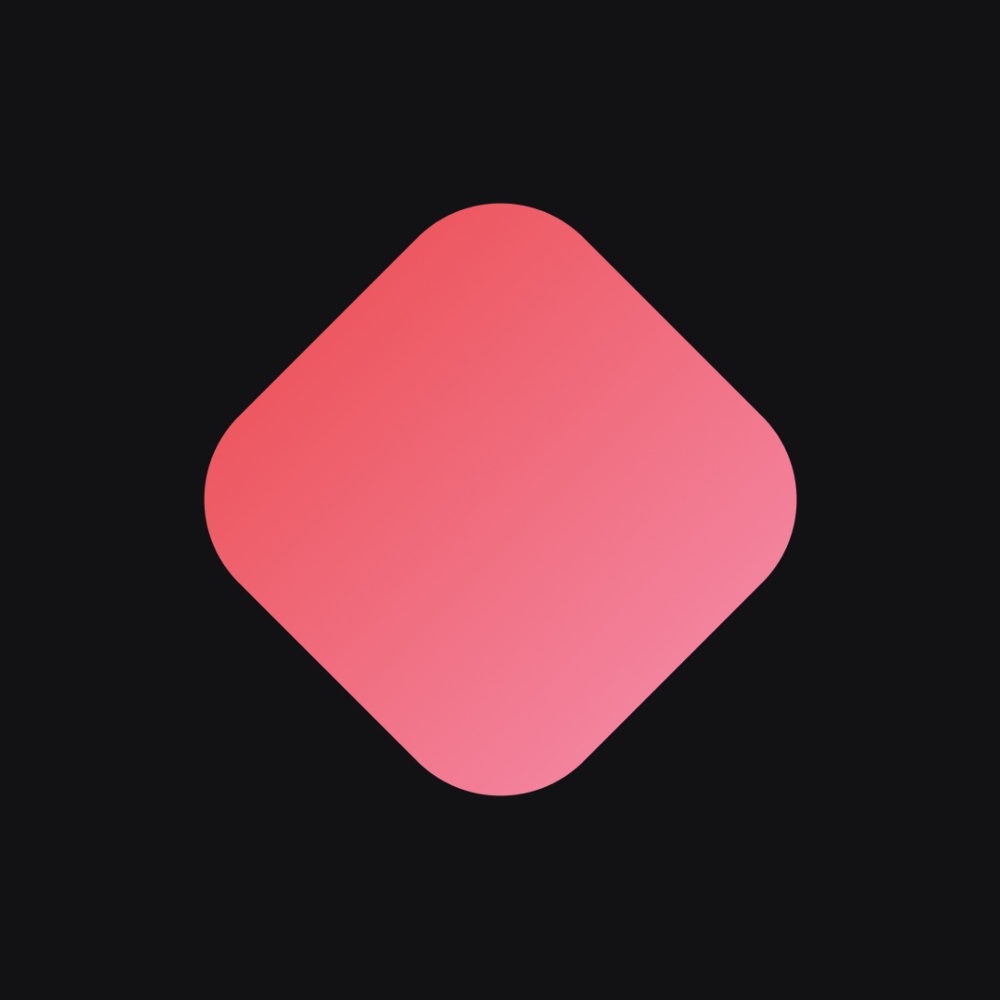

    
    
Rustbase

# Rustbase
A noSQL document-oriented database cross-platform program written in [Rust](https://www.rust-lang.org/)

# 🔗 Contribute
[Click here](./CONTRIBUTE.md) to see how to Contribute

# Authors

    <a href="https://github.com/pedrinfx">
        
        
pedrinfx

    </a>

# License
[MIT License](./LICENSE)